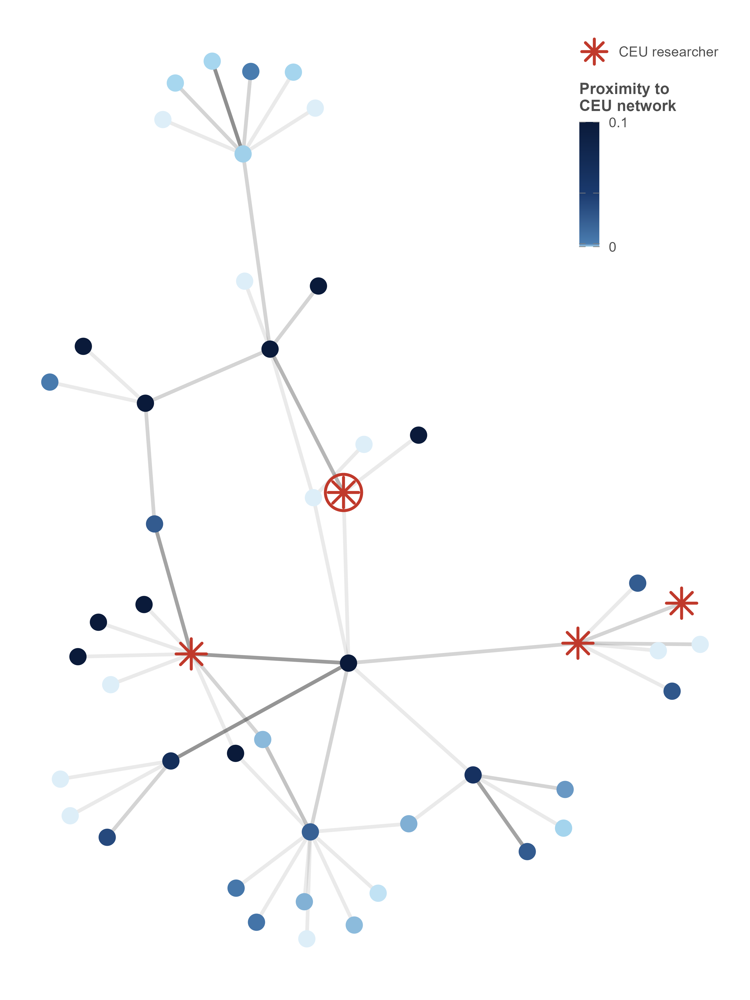

I am a PhD candidate in Economics at [Paris School of Economics (PSE)](https://www.parisschoolofeconomics.eu/), [Collège de France](https://www.college-de-france.fr/fr) and [EHESS](https://www.ehess.fr/fr). I am supervised by [Philippe Aghion](https://www.philippeaghion.com/) and affiliated with the [Farhi Innovation Lab](https://www.farhi-innovation-lab.fr/).

**I'll be on the 2026-2027 academic job market.**

My research interests lie in the **Economics of Science and Innovation** and in **Political Economy**. My main focus is on how political institutions shape innovation, especially **how political pressures affect academics' production of ideas**.

Since 2023, I co-organize the [Brown Bag Economics of Innovation Seminar](https://www.parisschoolofeconomics.eu/evenements/brown-bag-economics-of-innovation-seminar/), which is a joint seminar between the Collège de France and INSEAD. Feel free to contact me if you would like to present.

In 2025, I was a visiting scholar at the Department of Applied Economics of the Universitat Autonoma de Barcelona (hosted by [Riccardo Turati](https://sites.google.com/view/riccardoturati)), and the University of Munich LMU (hosted by [Fabian Waldinger](https://www.fabianwaldinger.com/)). During the Spring term 2026 I visited the University of Warwick (hosted by [Sascha O. Becker](https://www.sobecker.de/)).

**Contact:** [luc.paluskiewicz[at]psemail.eu](mailto:luc.paluskiewicz@psemail.eu)

You can find my CV [here](https://lucpaluskiewicz.github.io/Luc_PALUSKIEWICZ_CV_En.pdf).

---

## Job Market Paper

<strong style="color:#211e29; font-size: 1.05rem;">How to Silence Researchers? Evidence from Illiberal Policies in Hungary</strong>

 with <a href="https://raphaelwargon.github.io/" style="color: #555; text-decoration: none;">Raphaël Wargon</a> 
<a href="https://papers.ssrn.com/sol3/papers.cfm?abstract_id=7157679" style="color:#c43e54; font-size: 0.9rem; text-decoration: none;">[Last version]</a> 

<u><strong>Abstract</strong></u>

 We explore how contemporary attacks against academic freedom have detrimental effects on innovation, focusing on academic research in Hungary after the election of Viktor Orbán in 2010. Using rich national research repositories and international bibliometric data, we show that academics' trajectories diverge sharply depending on their perceived political alignment towards the government. Academics perceived as politically non-aligned experience a large decrease in their productivity and quality of their work. We explain this loss through the shrinking networks and declining influence of these authors. Targeted academics respond strongly, including by leaving the country and expressing dissent against the government. We show that academics self-censor in their academic work. Finally, individual-level crosscountry comparisons allow us to estimate the broader effects of declining academic freedom: Hungarian researchers increasingly reallocate their publication efforts toward lower-ranked national-language journals and are more likely to leave the country altogether. 

<u>Past presentations:</u> Innovation Seminar (LMU), Brown Bag Seminar in Innovation Economics (Collège de France and INSEAD), Applied Young Economists Webinar (AYEW), Political Economy & Public Economics Reading Group (University of Warwick), 2026 EAYE Annual Meeting, 2nd EUI ECO PhD Workshop (co-author), BSE Summer Forum Economics of Science and Innovation, CERGIC Internal Seminar, 8th International Conference on European Economics and Politics, NBER Summer Institute 2026 Science of Science Funding. 

<u>Upcoming presentations:</u> EEA 2026 Annual Meeting.

